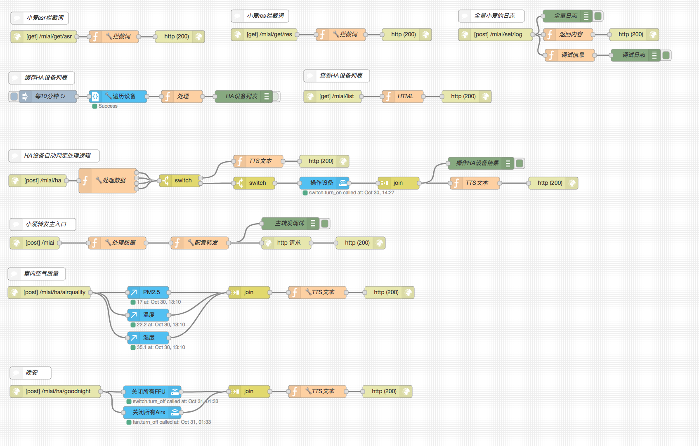

# mico

小爱拦截器 开发版

## 具体见帖子
https://bbs.hassbian.com/thread-5110-1-1.html

## 一键安装
```shell
curl -s "https://raw.githubusercontent.com/FlashSoft/mico/dev/install.sh?`date +%s`" > /root/install.sh
sh /root/install.sh
```

## NodeRed截图



## NodeRed流（直接导入）

```json
[{"id":"50a9f5e.b33610c","type":"tab","label":"处理小爱转发V3","disabled":false,"info":""},{"id":"c99debc2.933f78","type":"debug","z":"50a9f5e.b33610c","name":"HA设备列表","active":false,"tosidebar":true,"console":false,"tostatus":false,"complete":"true","x":610,"y":235,"wires":[]},{"id":"d4deea9.e378d18","type":"api-render-template","z":"50a9f5e.b33610c","name":"🔧遍历设备","server":"4ccda836.aef688","template":"\n{{ state.domain }}||||{{ state.entity_id }}||||{{ state.attributes.friendly_name }}\n  \n","x":305,"y":235,"wires":[["64fbe9c2.c74258"]]},{"id":"64fbe9c2.c74258","type":"function","z":"50a9f5e.b33610c","name":"处理","func":"const device_list = msg.payload.split('\\n').map(it => {\n  const [domain, entity_id, friendly_name] = it.split('||||')\n  return { domain, entity_id, friendly_name }\n})\nconst list = device_list.map(it => `${it.domain}\\t${it.friendly_name}`).join('\\n')\nflow.set('device_list', device_list)\nnode.status({fill:'green', text: (new Date()).toLocaleTimeString()})\nreturn {device_list, list}","outputs":1,"noerr":0,"x":460,"y":235,"wires":[["c99debc2.933f78"]]},{"id":"8d91e59c.7298c8","type":"inject","z":"50a9f5e.b33610c","name":"每10分钟","topic":"","payload":"","payloadType":"date","repeat":"600","crontab":"","once":true,"onceDelay":"1","x":135,"y":235,"wires":[["d4deea9.e378d18"]]},{"id":"9878305e.8d142","type":"api-call-service","z":"50a9f5e.b33610c","name":"操作设备","server":"4ccda836.aef688","service_domain":"","service":"","data":"","mergecontext":"","x":805,"y":445,"wires":[["e70679a2.f179a8"]]},{"id":"c6c5af4f.30365","type":"http in","z":"50a9f5e.b33610c","name":"","url":"/miai/get/asr","method":"get","upload":false,"swaggerDoc":"","x":125,"y":90,"wires":[["cf1f3130.17c31"]]},{"id":"dc997254.12ac","type":"http response","z":"50a9f5e.b33610c","name":"","statusCode":"200","headers":{},"x":455,"y":90,"wires":[]},{"id":"cf1f3130.17c31","type":"function","z":"50a9f5e.b33610c","name":"🔧拦截词","func":"// 多个词以竖线分割\nmsg.payload = `早安|晚安`\nreturn msg","outputs":1,"noerr":0,"x":295,"y":90,"wires":[["dc997254.12ac"]]},{"id":"f92acc00.a5ec8","type":"comment","z":"50a9f5e.b33610c","name":"小爱asr拦截词","info":"这里主要是配置你对小爱说的话的部分\n\n正常情况你跟小爱说\"早安\"是不会转发给NodeRed的\n\n所以为了能说\"早安\"的时候走你的自定义的流程,需要配置下你先拦截的词语列表\n","x":115,"y":45,"wires":[]},{"id":"a5fa462f.898838","type":"comment","z":"50a9f5e.b33610c","name":"缓存HA设备列表","info":"这个流里主要目的是为了能够定时遍历HA的设备列表\n\n为了给HA设备自动操作的流做准备工作\n\n默认每10分钟执行一次\n\n在保存流后1秒也会自动执行一次\n\n平时无需手动执行此流\n\n调试办法:\n\n可以手动点一次执行按钮,然后看调试窗口,找到HA设备列表调试项,展开list条目,可看到当前HA的设备列表","x":120,"y":190,"wires":[]},{"id":"5c8c8822.c4aae8","type":"comment","z":"50a9f5e.b33610c","name":"HA设备自动判定处理逻辑","info":"此流解决通过操作词进行控制HA设备列表里的设备\n\n可以手动执行缓存HA列表流去看调试信息里的设备列表,然后试图去开关他,支持同时最大控制4个设备\n\n如果设备列表是:\n\n```\nbinary_sensor\t大门状态\nbinary_sensor\t楼梯人体感应\nbinary_sensor\t楼上开关\nbinary_sensor\t大门门铃\nfan\t楼上净化器\nfan\t楼下净化器\ngroup\tAirx空气净化器\ngroup\tall fans\ngroup\tall lights\ngroup\tall switches\ngroup\tall vacuum cleaners\ngroup\t北京\ngroup\t客厅空气检测仪\ngroup\t小米\ninput_select\t亮度\nlight\t小夜灯\nsensor\t主卧湿度\nsensor\t光照度\nsensor\t甲醛\nsensor\t湿度\nsensor\t颗粒物\nsensor\t温度\nsensor\t主卧温度\nsensor\t彩云天气\nswitch\t主卧加湿器\nswitch\t小爱开关\nswitch\t书房插座\nswitch\t楼下FFU\nswitch\t功率插座\nswitch\t楼上FFU\nswitch\tUSB插座\nvacuum\t楼上扫地机器人\n```\n\n\n我们可以这样去控制设备:\n\n```\n打开楼上扫地机器人\n打开小夜灯和主卧加湿器\n关闭书房插座\n```\n","x":150,"y":379,"wires":[]},{"id":"f73c7442.0df7c8","type":"http in","z":"50a9f5e.b33610c","name":"","url":"/miai/ha","method":"post","upload":false,"swaggerDoc":"","x":110,"y":439,"wires":[["47f8345a.030bcc"]]},{"id":"5f2f6570.b2435c","type":"function","z":"50a9f5e.b33610c","name":"TTS文本","func":"// 操作成功文案,可变更成其他词\nmsg.payload = `操作已成功`\nnode.status({fill:'green', text: `更新:${(new Date()).toLocaleTimeString()} TTS: ${msg.payload}`})\nreturn msg","outputs":1,"noerr":0,"x":1170,"y":445,"wires":[["5b0381d.addc38"]]},{"id":"e70679a2.f179a8","type":"join","z":"50a9f5e.b33610c","name":"","mode":"custom","build":"array","property":"payload","propertyType":"msg","key":"topic","joiner":"\\n","joinerType":"str","accumulate":false,"timeout":"0.1","count":"","reduceRight":false,"reduceExp":"","reduceInit":"","reduceInitType":"","reduceFixup":"","x":985,"y":445,"wires":[["5f2f6570.b2435c","c502a43.7309958"]]},{"id":"5b0381d.addc38","type":"http response","z":"50a9f5e.b33610c","name":"","statusCode":"200","headers":{},"x":1360,"y":445,"wires":[]},{"id":"47f8345a.030bcc","type":"function","z":"50a9f5e.b33610c","name":"🔧处理数据","func":"// POST接口\n// 支持两个参数\n// cmd: 必选参数,操作指令,类似\"打开书房插座和小爱开关\"\n// tts: 可选参数,用于找不到设备时的内容返回\n\n\nconst cmd = msg.payload.cmd || ''\nconst tts = msg.payload.tts || ''\n\n// 服务列表,一般不用动了\nconst service_list = {\n  // 开关词与动作映射,酌情修改\n  'act': {\n    'turn_on': ['打开', '开开', '开启'],\n    'turn_off': ['关闭', '关掉']\n  },\n  // 特殊设备的开关动作映射\n  'alias': {\n    'cover': { 'turn_on': 'open_cover', 'turn_off': 'close_cover' },\n    'lock': { 'turn_on': 'unlock', 'turn_off': 'lock' }\n  }\n}\n\n//=== 以下内容谨慎修改 ===============================================================\n// 获取HA设备列表,从另外一个流中获取\nconst device_list = flow.get('device_list')\n// 生成需操作的设备列表\nconst list = device_list.filter(it => {\n  let service = ''\n  for (var key in service_list.act) {\n    if (!!service_list.act[key].filter(it => !!~cmd.indexOf(it)).length) {\n      service = key\n      break\n    }\n  }\n  if (!!~cmd.indexOf(it.friendly_name) && service !== '') {\n    return (it.service = service)\n  }\n}).map(it => {\n  it.data = { entity_id: it.entity_id }\n  return it\n})\nconst multi_list = list.map(it => {\n  return { res: msg.res, req: msg.req, payload: it, list, cmd, tts }\n})\nmulti_list.push({res:msg.res, req:msg.req, payload: {}, list, cmd, tts})\nnode.status({fill:'green', text: `更新:${(new Date()).toLocaleTimeString()}`})\nreturn multi_list","outputs":4,"noerr":0,"x":280,"y":439,"wires":[["42c881da.6e936"],["42c881da.6e936"],["42c881da.6e936"],["42c881da.6e936"]]},{"id":"bb223237.e0386","type":"function","z":"50a9f5e.b33610c","name":"TTS文本","func":"msg.payload = `嘿嘿嘿,${msg.tts}`\nnode.status({fill:'green', text: `更新:${(new Date()).toLocaleTimeString()} TTS: ${msg.payload}`})\nreturn msg","outputs":1,"noerr":0,"x":645,"y":392,"wires":[["eb0cef32.33fc1"]]},{"id":"eb0cef32.33fc1","type":"http response","z":"50a9f5e.b33610c","name":"","statusCode":"200","headers":{},"x":805,"y":392,"wires":[]},{"id":"d26ee31d.2a5f8","type":"switch","z":"50a9f5e.b33610c","name":"","property":"payload.domain","propertyType":"msg","rules":[{"t":"nnull"}],"checkall":"true","repair":false,"outputs":1,"x":635,"y":445,"wires":[["9878305e.8d142"]]},{"id":"42c881da.6e936","type":"switch","z":"50a9f5e.b33610c","name":"","property":"list.length","propertyType":"msg","rules":[{"t":"eq","v":"0","vt":"str"},{"t":"gt","v":"0","vt":"str"}],"checkall":"true","repair":false,"outputs":2,"x":455,"y":439,"wires":[["bb223237.e0386"],["d26ee31d.2a5f8"]]},{"id":"26af14fb.8dfa3c","type":"http request","z":"50a9f5e.b33610c","name":"","method":"POST","ret":"txt","url":"","tls":"","x":713,"y":590,"wires":[["d821983f.417f38"]]},{"id":"641a02ff.b945dc","type":"http in","z":"50a9f5e.b33610c","name":"","url":"/miai","method":"post","upload":false,"swaggerDoc":"","x":103,"y":590,"wires":[["ebd83096.ac02a"]]},{"id":"ebd83096.ac02a","type":"function","z":"50a9f5e.b33610c","name":"🔧处理数据","func":"// POST接口\n\n// 参数列表\n// cmd: 调试用的操作词\n// asr: 小爱传递上来的asr内容\n// res: 小爱专递上来的res内容\n\nlet queries = []\nlet tts = ''\nmsg.payload.cmd && queries.push(msg.payload.cmd)\ntry { queries = JSON.parse(msg.payload.asr).response.queries.map(it => it.query) } catch (e) { }\n\ntry {\n  const res = JSON.parse(msg.payload.res);\n  tts = `${res.answer[0].content.to_speak}`\n} catch (e) {\n  tts = '不懂你说的啥'\n}\n\nconst list = [\n  // 第一种写法,直接转发给HA设备处理\n  {\n    // 操作词数组,需要配置小爱脚本完成拦截\n    alias: ['早安', '早上好'],\n    // 转发给NodeRed的ha设备操作接口\n    proxy: '/miai/ha',\n    // ha设备操作接口需要的指令语句\n    cmd: '打开功率插座和小爱开关'\n  },\n  // 第二种写法,转发给另外一个接口进行处理\n  {\n    alias: ['晚安'],\n    proxy: '/miai/ha/goodnight'\n  },\n  // 同第二种写法,这里演示多传感器信息合并播报\n  {\n    alias: ['室内空气质量'],\n    proxy: '/miai/ha/airquality'\n  }\n]\n//=== 以下内容谨慎修改 ===============================================================\nmsg.queries = queries\nmsg.list = list\nmsg.tts = tts\nmsg.matched = !!list.filter((item, index) => {\n  item.matched = !!queries.filter(it => ~item.alias.indexOf(it)).length\n  if (item.matched) {\n    msg.matched_index = index\n    msg.matched_item = item\n  }\n  return item.matched\n}).length\n\nnode.status({ fill: 'green', text: `更新:${(new Date()).toLocaleTimeString()} 匹配: ${msg.matched}` })\n\nreturn msg","outputs":1,"noerr":0,"x":303,"y":590,"wires":[["5b58c1c9.b93e1"]]},{"id":"d821983f.417f38","type":"http response","z":"50a9f5e.b33610c","name":"","statusCode":"200","headers":{},"x":893,"y":590,"wires":[]},{"id":"f0d4af65.3c523","type":"http in","z":"50a9f5e.b33610c","name":"","url":"/miai/ha/airquality","method":"post","upload":false,"swaggerDoc":"","x":138,"y":710,"wires":[["c39049c1.3e7be8","99ab23a6.9c33a","8a443463.36d3e8"]]},{"id":"f4892b75.2c53c8","type":"comment","z":"50a9f5e.b33610c","name":"小爱转发主入口","info":"此流用来接收从小爱转发过来的asr里的query词\n\n\n所有的一切都是从这里开始的\n\n思路：\n\n小爱设备转发上来的asr内容在这个流里进行匹配和分发\n\n匹配到后可以直接分发给配置文件中指定的流,每个流都是一个POST接口\n\n如果未匹配到则直接把小爱的asr里的query词取第一个转发给HA的控制流,试图直接使用指令词去控制HA设备的开关\n\n如果HA的控制流没有任何可处理的设备则返回内容空\n\n\n举个例子:\n\n```\nconst list = [\n  // 第一种写法,直接转发给HA设备处理\n  {\n    // 操作词数组,需要配置小爱脚本完成拦截\n    alias: ['早安', '早上好'],\n    // 转发给NodeRed的ha设备操作接口\n    proxy: '/miai/ha',\n    // ha设备操作接口需要的指令语句\n    cmd: '打开功率插座和小爱开关'\n  },\n  // 第二种写法,转发给另外一个接口进行处理\n  {\n    alias: ['晚安'],\n    proxy: '/miai/ha/goodnight'\n  },\n  // 同第二种写法,这里演示多传感器信息合并播报\n  {\n    alias: ['室内空气质量'],\n    proxy: '/miai/ha/airquality'\n  }\n]\n```\n\n上个列表中一共有3组自定义的操作\n\n每组中有3个字段,作用分别是:\n\n\nalias\n```\n这个字段是用于跟小爱的asr里的query数组里的词进行匹配的\n比如小爱的asr的query词是\"早安\"或者是\"早上好\",那么则匹配到第一组配置\n```\n\nproxy\n```\n这个字段是属于转发的uri部分,我们通常是转发给当前NodeRed的其他接口进行处理\n比如/miai/ha\n这个就是在NodeRed里定义接收操作HA设备的接口URI,默认为post\n```\n\ncmd\n```\n这个是配合proxy字段使用的,主要用于给/miai/ha传递具体的指令内容\n由于/miai/ha接口的cmd接收的是类似于\"打开书房插座\"这种指令,所以cmd的取值应该为可以正常操作HA设备的指令词\n```\n","x":123,"y":545,"wires":[]},{"id":"64e5bb32.f962d4","type":"comment","z":"50a9f5e.b33610c","name":"室内空气质量","info":"","x":108,"y":665,"wires":[]},{"id":"c39049c1.3e7be8","type":"api-current-state","z":"50a9f5e.b33610c","name":"PM2.5","server":"4ccda836.aef688","halt_if":"","override_topic":true,"override_payload":true,"entity_id":"sensor.m1_pm25","x":378,"y":710,"wires":[["2f5e60db.102cb"]]},{"id":"99ab23a6.9c33a","type":"api-current-state","z":"50a9f5e.b33610c","name":"温度","server":"4ccda836.aef688","halt_if":"","override_topic":true,"override_payload":true,"entity_id":"sensor.m1_temperature","x":378,"y":765,"wires":[["2f5e60db.102cb"]]},{"id":"2f5e60db.102cb","type":"join","z":"50a9f5e.b33610c","name":"","mode":"custom","build":"object","property":"payload","propertyType":"msg","key":"topic","joiner":"\\n","joinerType":"str","accumulate":false,"timeout":"1","count":"3","reduceRight":false,"reduceExp":"","reduceInit":"","reduceInitType":"","reduceFixup":"","x":623,"y":710,"wires":[["2891ec64.69a764"]]},{"id":"8a443463.36d3e8","type":"api-current-state","z":"50a9f5e.b33610c","name":"湿度","server":"4ccda836.aef688","halt_if":"","override_topic":true,"override_payload":true,"entity_id":"sensor.m1_humidity","x":378,"y":820,"wires":[["2f5e60db.102cb"]]},{"id":"2891ec64.69a764","type":"function","z":"50a9f5e.b33610c","name":"🔧TTS文本","func":"msg.payload = `\n    当前室内PM2.5为${msg.payload['sensor.m1_pm25']}\n    温度${msg.payload['sensor.m1_temperature']}摄氏度\n    湿度${msg.payload['sensor.m1_humidity']}%\n`\nnode.status({fill:'green', text: `更新:${(new Date()).toLocaleTimeString()} TTS: ${msg.payload}`})\nreturn msg","outputs":1,"noerr":0,"x":788,"y":710,"wires":[["b61fc27d.9bcdf"]]},{"id":"b61fc27d.9bcdf","type":"http response","z":"50a9f5e.b33610c","name":"","statusCode":"200","headers":{},"x":963,"y":710,"wires":[]},{"id":"b3029ea5.defb1","type":"debug","z":"50a9f5e.b33610c","name":"主转发调试","active":true,"tosidebar":true,"console":false,"tostatus":false,"complete":"true","x":723,"y":543,"wires":[]},{"id":"c502a43.7309958","type":"debug","z":"50a9f5e.b33610c","name":"操作HA设备结果","active":true,"tosidebar":true,"console":false,"tostatus":false,"complete":"true","x":1185,"y":397,"wires":[]},{"id":"834bab1e.218948","type":"api-call-service","z":"50a9f5e.b33610c","name":"关闭所有FFU","server":"4ccda836.aef688","service_domain":"switch","service":"turn_off","data":"{\"entity_id\":\"switch.original_xiaomi_mi_smart_wifi_socket,switch.xiaomi_mi_smart_wifi_usb_socket\"}","mergecontext":"","x":388,"y":951,"wires":[["beefe6ab.f09348"]]},{"id":"52d8329a.1ff71c","type":"api-call-service","z":"50a9f5e.b33610c","name":"关闭所有Airx","server":"4ccda836.aef688","service_domain":"fan","service":"turn_off","data":"{\"entity_id\":\"fan.airx,fan.airx2\"}","mergecontext":"","x":388,"y":1001,"wires":[["beefe6ab.f09348"]]},{"id":"beefe6ab.f09348","type":"join","z":"50a9f5e.b33610c","name":"","mode":"custom","build":"array","property":"payload","propertyType":"msg","key":"","joiner":"\\n","joinerType":"str","accumulate":false,"timeout":"1","count":"2","reduceRight":false,"reduceExp":"","reduceInit":"","reduceInitType":"","reduceFixup":"","x":623,"y":950,"wires":[["e2e723fc.e4d69"]]},{"id":"e424ab63.80e548","type":"http in","z":"50a9f5e.b33610c","name":"","url":"/miai/ha/goodnight","method":"post","upload":false,"swaggerDoc":"","x":153,"y":950,"wires":[["834bab1e.218948","52d8329a.1ff71c"]]},{"id":"50c92150.e116b","type":"comment","z":"50a9f5e.b33610c","name":"晚安","info":"","x":93,"y":905,"wires":[]},{"id":"e2e723fc.e4d69","type":"function","z":"50a9f5e.b33610c","name":"🔧TTS文本","func":"msg.payload = '晚安吧'\nnode.status({fill:'green', text: `更新:${(new Date()).toLocaleTimeString()} TTS: ${msg.payload}`})\nreturn msg","outputs":1,"noerr":0,"x":788,"y":950,"wires":[["99696025.ab7aa"]]},{"id":"99696025.ab7aa","type":"http response","z":"50a9f5e.b33610c","name":"","statusCode":"200","headers":{},"x":958,"y":950,"wires":[]},{"id":"54db89a2.7737f8","type":"http in","z":"50a9f5e.b33610c","name":"","url":"/miai/get/res","method":"get","upload":false,"swaggerDoc":"","x":659,"y":85,"wires":[["7412ff3c.619ed"]]},{"id":"68249ad7.f7ee94","type":"http response","z":"50a9f5e.b33610c","name":"","statusCode":"200","headers":{},"x":1005,"y":85,"wires":[]},{"id":"7412ff3c.619ed","type":"function","z":"50a9f5e.b33610c","name":"🔧拦截词","func":"// 多个词以竖线分割\nmsg.payload = `soundboxControlTV`\nreturn msg","outputs":1,"noerr":0,"x":845,"y":85,"wires":[["68249ad7.f7ee94"]]},{"id":"4b4d3188.9ee63","type":"comment","z":"50a9f5e.b33610c","name":"小爱res拦截词","info":"这里主要是配置小爱远端服务器返回的响应内容的匹配部分\n\n大多数情况下,在你说话控制一个不存在的设备的时候,小爱会返回一个操作设备的标志位,已在脚本中进行了主动拦截\n\n但是有一些例外,比如操作智能电视\n\n如遇到未捕获的情况,可以在这里进行配置特定词语,不推荐使用\"没有\"这个词,因为段子和歌曲里都有可能出现这个词","x":649,"y":40,"wires":[]},{"id":"e6e46051.21119","type":"http in","z":"50a9f5e.b33610c","name":"","url":"/miai/set/log","method":"post","upload":false,"swaggerDoc":"","x":1220,"y":85,"wires":[["cdbd2af.2d6acd8","20207240.9eee7e","2cea0054.4db4"]]},{"id":"2c5ab385.28453c","type":"http response","z":"50a9f5e.b33610c","name":"","statusCode":"200","headers":{},"x":1556,"y":85,"wires":[]},{"id":"cdbd2af.2d6acd8","type":"function","z":"50a9f5e.b33610c","name":"返回内容","func":"msg.payload = 'ok'\nreturn msg","outputs":1,"noerr":0,"x":1396,"y":85,"wires":[["2c5ab385.28453c"]]},{"id":"ea8a4e2d.83caf","type":"comment","z":"50a9f5e.b33610c","name":"全量小爱的日志","info":"在这里接小爱的全量变更的asr和res内容,便于快速看到小爱上的日志内容\n\n方便去修改和定义asr和res的拦截词","x":1210,"y":40,"wires":[]},{"id":"4c622667.38df28","type":"http in","z":"50a9f5e.b33610c","name":"","url":"/miai/list","method":"get","upload":false,"swaggerDoc":"","x":825,"y":235,"wires":[["f02f7ee0.cd59c"]]},{"id":"f02f7ee0.cd59c","type":"function","z":"50a9f5e.b33610c","name":"HTML","func":"const device_list = flow.get('device_list')\nconst list = []\ndevice_list.map(it=>{\n  list.push(`<li>${it.domain} -> ${it.friendly_name}</li>`)\n})\n\nmsg.payload = `\n<!doctype html>\n<html>\n<head>\n<meta charset=\"utf-8\">\n<title>HA设备列表</title>\n</head>\n<body>\n  <ol>\n    ${list.join('')}\n  </ul>\n</body>\n</html>\n`\nreturn msg","outputs":1,"noerr":0,"x":995,"y":235,"wires":[["705d6873.d42928"]]},{"id":"705d6873.d42928","type":"http response","z":"50a9f5e.b33610c","name":"","statusCode":"200","headers":{},"x":1150,"y":235,"wires":[]},{"id":"b26954b6.3e1ff8","type":"comment","z":"50a9f5e.b33610c","name":"查看HA设备列表","info":"一个简单网页查看HA设备列表\n\n直接打开NodeRed的`http://NodeRed IP/miai/list`","x":835,"y":185,"wires":[]},{"id":"20207240.9eee7e","type":"function","z":"50a9f5e.b33610c","name":"调试信息","func":"let queries = ''\ntry { queries = JSON.parse(msg.payload.asr).response.queries.map(it => it.query).join(',') } catch (e) { }\nlet domain = '未知'\ntry { domain = JSON.parse(msg.payload.res).answer[0].domain } catch (e) { }\nlet code = '未知'\ntry { code = JSON.parse(msg.payload.res).status.extend.code } catch (e) { }\nlet err = '未知'\ntry { err = JSON.parse(msg.payload.res).status.extend.name } catch (e) { }\nreturn {queries, domain, code, err}","outputs":1,"noerr":0,"x":1400,"y":135,"wires":[["80d62564.8a2be8"]]},{"id":"80d62564.8a2be8","type":"debug","z":"50a9f5e.b33610c","name":"调试日志","active":true,"tosidebar":true,"console":false,"tostatus":false,"complete":"true","x":1560,"y":135,"wires":[]},{"id":"2cea0054.4db4","type":"debug","z":"50a9f5e.b33610c","name":"全量日志","active":true,"tosidebar":true,"console":false,"tostatus":false,"complete":"true","x":1395,"y":40,"wires":[]},{"id":"5b58c1c9.b93e1","type":"function","z":"50a9f5e.b33610c","name":"🔧配置转发","func":"// @fixme: 可能会存在hassio的nodred密码问题,需要结合实际进行调试\n// 如果在前面的流程里找到匹配的设备则转发给对应流程处理\n\nconst tts = msg.tts\n\nif (msg.matched) {\n  // 根据自己的NodeRed地址情况进行修改,如果有密码去后面的http请求里设置下账号密码\n  msg.url = `http://127.0.0.1:1880${msg.matched_item.proxy}`\n  msg.payload = { cmd: msg.matched_item.cmd, tts }\n}\n// 如果没有匹配到则试图转发给HA自动判断\nelse {\n  // 根据自己的NodeRed地址情况进行修改,如果有密码去后面的http请求里设置下账号密码\n  msg.url = `http://127.0.0.1:1880/miai/ha`\n  msg.payload = { cmd: msg.queries[0], tts }\n}\nnode.status({fill:'green', text: `更新:${(new Date()).toLocaleTimeString()} 匹配: ${msg.matched} 预备TTS: ${tts}`})\nreturn msg","outputs":1,"noerr":0,"x":503,"y":590,"wires":[["b3029ea5.defb1","26af14fb.8dfa3c"]]},{"id":"4ccda836.aef688","type":"server","z":"","name":"HASS","legacy":false}]
```

## NodeRed流[Hassio]（直接导入）
```json
[{"id":"7f4ff722.f627e8","type":"tab","label":"miai_interception_V3","disabled":false,"info":""},{"id":"ab0062b7.8d4d28","type":"debug","z":"7f4ff722.f627e8","name":"HA_device_list","active":false,"tosidebar":true,"console":false,"tostatus":false,"complete":"true","targetType":"full","x":620,"y":235,"wires":[]},{"id":"d66306d8.11e9","type":"api-render-template","z":"7f4ff722.f627e8","name":"遍历设备","server":"e8ae8f26.e5ef7","template":"\n{{ state.domain }}||||{{ state.entity_id }}||||{{ state.attributes.friendly_name }}\n  \n","resultsLocation":"payload","resultsLocationType":"msg","templateLocation":"template","templateLocationType":"msg","x":295,"y":235,"wires":[["57875e51.d2fc78"]]},{"id":"57875e51.d2fc78","type":"function","z":"7f4ff722.f627e8","name":"generate_device_list","func":"const device_list = msg.payload.split('\\n').map(it => {\n  const [domain, entity_id, friendly_name] = it.split('||||')\n  return { domain, entity_id, friendly_name }\n})\nconst list = device_list.map(it => `${it.domain}\\t${it.friendly_name}`).join('\\n')\nflow.set('device_list', device_list)\nnode.status({fill:'green', text: (new Date()).toLocaleTimeString()})\nreturn {device_list, list}","outputs":1,"noerr":0,"x":460,"y":180,"wires":[["ab0062b7.8d4d28"]]},{"id":"bfcdebd0.ce79f8","type":"inject","z":"7f4ff722.f627e8","name":"every_ten_minutes","topic":"","payload":"","payloadType":"date","repeat":"600","crontab":"","once":true,"onceDelay":"1","x":150,"y":300,"wires":[["d66306d8.11e9"]]},{"id":"92293308.55fe78","type":"api-call-service","z":"7f4ff722.f627e8","name":"call_service","server":"e8ae8f26.e5ef7","version":1,"service_domain":"","service":"","entityId":"","data":"","dataType":"json","mergecontext":"","output_location":"payload","output_location_type":"msg","mustacheAltTags":false,"x":815,"y":445,"wires":[["1b24a716.31e231"]]},{"id":"ceed7e8.5831c8","type":"http in","z":"7f4ff722.f627e8","name":"","url":"/miai/get/asr","method":"get","upload":false,"swaggerDoc":"","x":125,"y":90,"wires":[["1111c8e.ecb14b7"]]},{"id":"1e4650.054029b1","type":"http response","z":"7f4ff722.f627e8","name":"","statusCode":"200","headers":{},"x":455,"y":90,"wires":[]},{"id":"1111c8e.ecb14b7","type":"function","z":"7f4ff722.f627e8","name":"intercepting_key_words","func":"// 多个词以竖线分割\nmsg.payload = `关闭|小房间`\nreturn msg","outputs":1,"noerr":0,"x":330,"y":40,"wires":[["1e4650.054029b1"]]},{"id":"d938cf0c.d53a4","type":"comment","z":"7f4ff722.f627e8","name":"asr_key_word","info":"这里主要是配置你对小爱说的话的部分\n\n正常情况你跟小爱说\"早安\"是不会转发给NodeRed的\n\n所以为了能说\"早安\"的时候走你的自定义的流程,需要配置下你先拦截的词语列表\n","x":115,"y":45,"wires":[]},{"id":"60416409.109e5c","type":"comment","z":"7f4ff722.f627e8","name":"caching_device_list","info":"这个流里主要目的是为了能够定时遍历HA的设备列表\n\n为了给HA设备自动操作的流做准备工作\n\n默认每10分钟执行一次\n\n在保存流后1秒也会自动执行一次\n\n平时无需手动执行此流\n\n调试办法:\n\n可以手动点一次执行按钮,然后看调试窗口,找到HA设备列表调试项,展开list条目,可看到当前HA的设备列表","x":130,"y":190,"wires":[]},{"id":"31440a4.b946e76","type":"comment","z":"7f4ff722.f627e8","name":"HA设备自动判定处理逻辑","info":"此流解决通过操作词进行控制HA设备列表里的设备\n\n可以手动执行缓存HA列表流去看调试信息里的设备列表,然后试图去开关他,支持同时最大控制4个设备\n\n如果设备列表是:\n\n```\nbinary_sensor\t大门状态\nbinary_sensor\t楼梯人体感应\nbinary_sensor\t楼上开关\nbinary_sensor\t大门门铃\nfan\t楼上净化器\nfan\t楼下净化器\ngroup\tAirx空气净化器\ngroup\tall fans\ngroup\tall lights\ngroup\tall switches\ngroup\tall vacuum cleaners\ngroup\t北京\ngroup\t客厅空气检测仪\ngroup\t小米\ninput_select\t亮度\nlight\t小夜灯\nsensor\t主卧湿度\nsensor\t光照度\nsensor\t甲醛\nsensor\t湿度\nsensor\t颗粒物\nsensor\t温度\nsensor\t主卧温度\nsensor\t彩云天气\nswitch\t主卧加湿器\nswitch\t小爱开关\nswitch\t书房插座\nswitch\t楼下FFU\nswitch\t功率插座\nswitch\t楼上FFU\nswitch\tUSB插座\nvacuum\t楼上扫地机器人\n```\n\n\n我们可以这样去控制设备:\n\n```\n打开楼上扫地机器人\n打开小夜灯和主卧加湿器\n关闭书房插座\n```\n","x":150,"y":379,"wires":[]},{"id":"a7faea9d.ec38c","type":"http in","z":"7f4ff722.f627e8","name":"","url":"/miai/ha","method":"post","upload":false,"swaggerDoc":"","x":110,"y":439,"wires":[["9a7986b4.7387"]]},{"id":"336406ae.cb15f2","type":"function","z":"7f4ff722.f627e8","name":"TTS文本","func":"// 操作成功文案,可变更成其他词\nmsg.payload = `操作已成功`\nnode.status({fill:'green', text: `更新:${(new Date()).toLocaleTimeString()} TTS: ${msg.payload}`})\nreturn msg","outputs":1,"noerr":0,"x":1170,"y":445,"wires":[["414a4c2b.277f1c"]]},{"id":"1b24a716.31e231","type":"join","z":"7f4ff722.f627e8","name":"","mode":"custom","build":"array","property":"payload","propertyType":"msg","key":"topic","joiner":"\\n","joinerType":"str","accumulate":false,"timeout":"0.1","count":"","reduceRight":false,"reduceExp":"","reduceInit":"","reduceInitType":"","reduceFixup":"","x":990,"y":440,"wires":[["336406ae.cb15f2","8f518d92.1a7db8"]]},{"id":"414a4c2b.277f1c","type":"http response","z":"7f4ff722.f627e8","name":"","statusCode":"200","headers":{},"x":1360,"y":445,"wires":[]},{"id":"9a7986b4.7387","type":"function","z":"7f4ff722.f627e8","name":"🔧处理数据","func":"// POST接口\n// 支持两个参数\n// cmd: 必选参数,操作指令,类似\"打开书房插座和小爱开关\"\n// tts: 可选参数,用于找不到设备时的内容返回\n\n\nconst cmd = msg.payload.cmd || ''\nconst tts = msg.payload.tts || ''\n\n// 服务列表,一般不用动了\nconst service_list = {\n  // 开关词与动作映射,酌情修改\n  'act': {\n    'turn_on': ['打开', '开开', '开启'],\n    'turn_off': ['关闭', '关掉']\n  },\n  // 特殊设备的开关动作映射\n  'alias': {\n    'cover': { 'turn_on': 'open_cover', 'turn_off': 'close_cover' },\n    'lock': { 'turn_on': 'unlock', 'turn_off': 'lock' }\n  }\n}\n\n//=== 以下内容谨慎修改 ===============================================================\n// 获取HA设备列表,从另外一个流中获取\nconst device_list = flow.get('device_list')\n// 生成需操作的设备列表\nconst list = device_list.filter(it => {\n  let service = ''\n  for (var key in service_list.act) {\n    if (!!service_list.act[key].filter(it => !!~cmd.indexOf(it)).length) {\n      service = key\n      break\n    }\n  }\n  if (!!~cmd.indexOf(it.friendly_name) && service !== '') {\n    return (it.service = service)\n  }\n}).map(it => {\n  it.data = { entity_id: it.entity_id }\n  return it\n})\nconst multi_list = list.map(it => {\n  return { res: msg.res, req: msg.req, payload: it, list, cmd, tts }\n})\nmulti_list.push({res:msg.res, req:msg.req, payload: {}, list, cmd, tts})\nnode.status({fill:'green', text: `更新:${(new Date()).toLocaleTimeString()}`})\nreturn multi_list","outputs":4,"noerr":0,"x":310,"y":440,"wires":[["c7216e86.a511c8"],["c7216e86.a511c8"],["c7216e86.a511c8"],["c7216e86.a511c8"]]},{"id":"8333dcee.1b6f4","type":"function","z":"7f4ff722.f627e8","name":"TTS文本","func":"msg.payload = `长度为0,${msg.tts}`\nnode.status({fill:'green', text: `更新:${(new Date()).toLocaleTimeString()} TTS: ${msg.payload}`})\nreturn msg","outputs":1,"noerr":0,"x":645,"y":392,"wires":[["82cd0173.04a21"]]},{"id":"82cd0173.04a21","type":"http response","z":"7f4ff722.f627e8","name":"","statusCode":"200","headers":{},"x":805,"y":392,"wires":[]},{"id":"94d62336.bd12a","type":"switch","z":"7f4ff722.f627e8","name":"","property":"payload.domain","propertyType":"msg","rules":[{"t":"nnull"}],"checkall":"true","repair":false,"outputs":1,"x":635,"y":445,"wires":[["92293308.55fe78","45545be1.497534"]]},{"id":"c7216e86.a511c8","type":"switch","z":"7f4ff722.f627e8","name":"","property":"list.length","propertyType":"msg","rules":[{"t":"eq","v":"0","vt":"str"},{"t":"gt","v":"0","vt":"str"}],"checkall":"true","repair":false,"outputs":2,"x":470,"y":440,"wires":[["8333dcee.1b6f4"],["94d62336.bd12a","bc72657d.61877"]]},{"id":"a3ac761d.0e97b8","type":"http request","z":"7f4ff722.f627e8","name":"","method":"POST","ret":"txt","paytoqs":false,"url":"http://127.0.0.1:1880/endpoint/miai/ha","tls":"","persist":false,"proxy":"","authType":"basic","x":713,"y":590,"wires":[["24f09e2b.461002"]]},{"id":"a0710d35.1f4b78","type":"http in","z":"7f4ff722.f627e8","name":"","url":"/miai","method":"post","upload":false,"swaggerDoc":"","x":103,"y":590,"wires":[["2b309363.a3e984"]]},{"id":"2b309363.a3e984","type":"function","z":"7f4ff722.f627e8","name":"🔧处理数据","func":"// POST接口\n\n// 参数列表\n// cmd: 调试用的操作词\n// asr: 小爱传递上来的asr内容\n// res: 小爱专递上来的res内容\n\nlet queries = []\nlet tts = ''\nmsg.payload.cmd && queries.push(msg.payload.cmd)\ntry { queries = JSON.parse(msg.payload.asr).response.queries.map(it => it.query) } catch (e) { }\n\ntry {\n  const res = JSON.parse(msg.payload.res);\n  tts = `${res.answer[0].content.to_speak}`\n} catch (e) {\n  tts = '不懂你说的啥'\n}\n\nconst list = [\n  // 第一种写法,直接转发给HA设备处理\n  {\n    // 操作词数组,需要配置小爱脚本完成拦截\n    alias: ['早安', '早上好'],\n    // 转发给NodeRed的ha设备操作接口\n    proxy: '/endpoint/miai/ha',\n    // ha设备操作接口需要的指令语句\n    cmd: '关闭窗帘'\n  },\n  // 第二种写法,转发给另外一个接口进行处理\n  {\n    alias: ['晚安'],\n    proxy: '/miai/ha/goodnight'\n  },\n  // 同第二种写法,这里演示多传感器信息合并播报\n  {\n    alias: ['室内空气质量'],\n    proxy: '/miai/ha/airquality'\n  }\n]\n//=== 以下内容谨慎修改 ===============================================================\nmsg.queries = queries\nmsg.list = list\nmsg.tts = tts\nmsg.matched = !!list.filter((item, index) => {\n  item.matched = !!queries.filter(it => ~item.alias.indexOf(it)).length\n  if (item.matched) {\n    msg.matched_index = index\n    msg.matched_item = item\n  }\n  return item.matched\n}).length\n\nnode.status({ fill: 'green', text: `更新:${(new Date()).toLocaleTimeString()} 匹配: ${msg.matched}` })\n\nreturn msg","outputs":1,"noerr":0,"x":303,"y":590,"wires":[["170bfe48.23edf2","590cf568.bd39b4"]]},{"id":"24f09e2b.461002","type":"http response","z":"7f4ff722.f627e8","name":"","statusCode":"200","headers":{},"x":893,"y":590,"wires":[]},{"id":"3684369f.c182a2","type":"http in","z":"7f4ff722.f627e8","name":"","url":"/miai/ha/airquality","method":"post","upload":false,"swaggerDoc":"","x":138,"y":710,"wires":[["c6c23d7c.4d5958","ebd12bf8.8c412","83de650b.c9c9c"]]},{"id":"66afe3ad.12520c","type":"comment","z":"7f4ff722.f627e8","name":"小爱转发主入口","info":"此流用来接收从小爱转发过来的asr里的query词\n\n\n所有的一切都是从这里开始的\n\n思路：\n\n小爱设备转发上来的asr内容在这个流里进行匹配和分发\n\n匹配到后可以直接分发给配置文件中指定的流,每个流都是一个POST接口\n\n如果未匹配到则直接把小爱的asr里的query词取第一个转发给HA的控制流,试图直接使用指令词去控制HA设备的开关\n\n如果HA的控制流没有任何可处理的设备则返回内容空\n\n\n举个例子:\n\n```\nconst list = [\n  // 第一种写法,直接转发给HA设备处理\n  {\n    // 操作词数组,需要配置小爱脚本完成拦截\n    alias: ['早安', '早上好'],\n    // 转发给NodeRed的ha设备操作接口\n    proxy: '/miai/ha',\n    // ha设备操作接口需要的指令语句\n    cmd: '打开功率插座和小爱开关'\n  },\n  // 第二种写法,转发给另外一个接口进行处理\n  {\n    alias: ['晚安'],\n    proxy: '/miai/ha/goodnight'\n  },\n  // 同第二种写法,这里演示多传感器信息合并播报\n  {\n    alias: ['室内空气质量'],\n    proxy: '/miai/ha/airquality'\n  }\n]\n```\n\n上个列表中一共有3组自定义的操作\n\n每组中有3个字段,作用分别是:\n\n\nalias\n```\n这个字段是用于跟小爱的asr里的query数组里的词进行匹配的\n比如小爱的asr的query词是\"早安\"或者是\"早上好\",那么则匹配到第一组配置\n```\n\nproxy\n```\n这个字段是属于转发的uri部分,我们通常是转发给当前NodeRed的其他接口进行处理\n比如/miai/ha\n这个就是在NodeRed里定义接收操作HA设备的接口URI,默认为post\n```\n\ncmd\n```\n这个是配合proxy字段使用的,主要用于给/miai/ha传递具体的指令内容\n由于/miai/ha接口的cmd接收的是类似于\"打开书房插座\"这种指令,所以cmd的取值应该为可以正常操作HA设备的指令词\n```\n","x":120,"y":540,"wires":[]},{"id":"191cb3.c591ab4d","type":"comment","z":"7f4ff722.f627e8","name":"室内空气质量","info":"","x":108,"y":665,"wires":[]},{"id":"c6c23d7c.4d5958","type":"api-current-state","z":"7f4ff722.f627e8","name":"PM2.5","server":"e8ae8f26.e5ef7","version":"1","outputs":1,"halt_if":"","halt_if_type":"str","halt_if_compare":"is","override_topic":true,"entity_id":"sensor.m1_pm25","state_type":"str","state_location":"payload","override_payload":"msg","entity_location":"data","override_data":"msg","blockInputOverrides":false,"x":378,"y":710,"wires":[["a2f603e9.aacd3"]]},{"id":"ebd12bf8.8c412","type":"api-current-state","z":"7f4ff722.f627e8","name":"温度","server":"e8ae8f26.e5ef7","version":"1","outputs":1,"halt_if":"","halt_if_type":"str","halt_if_compare":"is","override_topic":true,"entity_id":"sensor.m1_temperature","state_type":"str","state_location":"payload","override_payload":"msg","entity_location":"data","override_data":"msg","blockInputOverrides":false,"x":378,"y":765,"wires":[["a2f603e9.aacd3"]]},{"id":"a2f603e9.aacd3","type":"join","z":"7f4ff722.f627e8","name":"","mode":"custom","build":"object","property":"payload","propertyType":"msg","key":"topic","joiner":"\\n","joinerType":"str","accumulate":false,"timeout":"1","count":"3","reduceRight":false,"reduceExp":"","reduceInit":"","reduceInitType":"","reduceFixup":"","x":623,"y":710,"wires":[["f2839150.a31bb"]]},{"id":"83de650b.c9c9c","type":"api-current-state","z":"7f4ff722.f627e8","name":"湿度","server":"e8ae8f26.e5ef7","version":"1","outputs":1,"halt_if":"","halt_if_type":"str","halt_if_compare":"is","override_topic":true,"entity_id":"sensor.m1_humidity","state_type":"str","state_location":"payload","override_payload":"msg","entity_location":"data","override_data":"msg","blockInputOverrides":false,"x":378,"y":820,"wires":[["a2f603e9.aacd3"]]},{"id":"f2839150.a31bb","type":"function","z":"7f4ff722.f627e8","name":"🔧TTS文本","func":"msg.payload = `\n    当前室内PM2.5为${msg.payload['sensor.m1_pm25']}\n    温度${msg.payload['sensor.m1_temperature']}摄氏度\n    湿度${msg.payload['sensor.m1_humidity']}%\n`\nnode.status({fill:'green', text: `更新:${(new Date()).toLocaleTimeString()} TTS: ${msg.payload}`})\nreturn msg","outputs":1,"noerr":0,"x":788,"y":710,"wires":[["f3612c4c.05278"]]},{"id":"f3612c4c.05278","type":"http response","z":"7f4ff722.f627e8","name":"","statusCode":"200","headers":{},"x":963,"y":710,"wires":[]},{"id":"590cf568.bd39b4","type":"debug","z":"7f4ff722.f627e8","name":"主转发调试","active":false,"tosidebar":true,"console":false,"tostatus":false,"complete":"true","x":310,"y":520,"wires":[]},{"id":"8f518d92.1a7db8","type":"debug","z":"7f4ff722.f627e8","name":"操作HA设备结果","active":false,"tosidebar":true,"console":false,"tostatus":false,"complete":"true","targetType":"full","x":1185,"y":397,"wires":[]},{"id":"61124886.631a08","type":"api-call-service","z":"7f4ff722.f627e8","name":"关闭所有FFU","server":"e8ae8f26.e5ef7","version":"1","service_domain":"switch","service":"turn_off","entityId":"switch.original_xiaomi_mi_smart_wifi_socket,switch.xiaomi_mi_smart_wifi_usb_socket","data":"","dataType":"json","mergecontext":"","output_location":"payload","output_location_type":"msg","mustacheAltTags":false,"x":388,"y":951,"wires":[["17b657d3.47388"]]},{"id":"3d07928c.d6c0c6","type":"api-call-service","z":"7f4ff722.f627e8","name":"关闭所有Airx","server":"e8ae8f26.e5ef7","version":"1","service_domain":"fan","service":"turn_off","entityId":"fan.airx,fan.airx2","data":"","dataType":"json","mergecontext":"","output_location":"payload","output_location_type":"msg","mustacheAltTags":false,"x":388,"y":1001,"wires":[["17b657d3.47388"]]},{"id":"17b657d3.47388","type":"join","z":"7f4ff722.f627e8","name":"","mode":"custom","build":"array","property":"payload","propertyType":"msg","key":"","joiner":"\\n","joinerType":"str","accumulate":false,"timeout":"1","count":"2","reduceRight":false,"reduceExp":"","reduceInit":"","reduceInitType":"","reduceFixup":"","x":623,"y":950,"wires":[["381d7f20.c96888"]]},{"id":"6409d113.9d1cc8","type":"http in","z":"7f4ff722.f627e8","name":"","url":"/miai/ha/goodnight","method":"post","upload":false,"swaggerDoc":"","x":153,"y":950,"wires":[["61124886.631a08","3d07928c.d6c0c6"]]},{"id":"63c1458b.1eda44","type":"comment","z":"7f4ff722.f627e8","name":"晚安","info":"","x":93,"y":905,"wires":[]},{"id":"381d7f20.c96888","type":"function","z":"7f4ff722.f627e8","name":"🔧TTS文本","func":"msg.payload = '晚安吧'\nnode.status({fill:'green', text: `更新:${(new Date()).toLocaleTimeString()} TTS: ${msg.payload}`})\nreturn msg","outputs":1,"noerr":0,"x":788,"y":950,"wires":[["9d49d4a0.a2202"]]},{"id":"9d49d4a0.a2202","type":"http response","z":"7f4ff722.f627e8","name":"","statusCode":"200","headers":{},"x":958,"y":950,"wires":[]},{"id":"173ee617.4ed5e2","type":"http in","z":"7f4ff722.f627e8","name":"","url":"/miai/get/res","method":"get","upload":false,"swaggerDoc":"","x":659,"y":85,"wires":[["60dea1b4.dec89"]]},{"id":"e6ffdf8c.fc3648","type":"http response","z":"7f4ff722.f627e8","name":"","statusCode":"200","headers":{},"x":1005,"y":85,"wires":[]},{"id":"60dea1b4.dec89","type":"function","z":"7f4ff722.f627e8","name":"🔧拦截词","func":"// 多个词以竖线分割\nmsg.payload = ``\nreturn msg","outputs":1,"noerr":0,"x":860,"y":40,"wires":[["e6ffdf8c.fc3648"]]},{"id":"b4121055.1d67d","type":"comment","z":"7f4ff722.f627e8","name":"res_key_words","info":"这里主要是配置小爱远端服务器返回的响应内容的匹配部分\n\n大多数情况下,在你说话控制一个不存在的设备的时候,小爱会返回一个操作设备的标志位,已在脚本中进行了主动拦截\n\n但是有一些例外,比如操作智能电视\n\n如遇到未捕获的情况,可以在这里进行配置特定词语,不推荐使用\"没有\"这个词,因为段子和歌曲里都有可能出现这个词","x":659,"y":40,"wires":[]},{"id":"1d394966.edaab7","type":"http in","z":"7f4ff722.f627e8","name":"","url":"/miai/set/log","method":"post","upload":false,"swaggerDoc":"","x":1120,"y":120,"wires":[["2a0d84bb.9be7e4","dee37a7.26dc688","349b154.927f36a"]]},{"id":"133a5975.268637","type":"http response","z":"7f4ff722.f627e8","name":"","statusCode":"200","headers":{},"x":1556,"y":85,"wires":[]},{"id":"2a0d84bb.9be7e4","type":"function","z":"7f4ff722.f627e8","name":"返回内容","func":"msg.payload = 'ok'\nreturn msg","outputs":1,"noerr":0,"x":1396,"y":85,"wires":[["133a5975.268637"]]},{"id":"d392274c.2579a","type":"comment","z":"7f4ff722.f627e8","name":"全量小爱的日志","info":"在这里接小爱的全量变更的asr和res内容,便于快速看到小爱上的日志内容\n\n方便去修改和定义asr和res的拦截词","x":1210,"y":40,"wires":[]},{"id":"9bd778f.f9d5b88","type":"http in","z":"7f4ff722.f627e8","name":"","url":"/miai/list","method":"get","upload":false,"swaggerDoc":"","x":825,"y":235,"wires":[["dcf1194d.0fb518"]]},{"id":"dcf1194d.0fb518","type":"function","z":"7f4ff722.f627e8","name":"HTML","func":"const device_list = flow.get('device_list')\nconst list = []\ndevice_list.map(it=>{\n  list.push(`<li>${it.domain} -> ${it.friendly_name}</li>`)\n})\n\nmsg.payload = `\n<!doctype html>\n<html>\n<head>\n<meta charset=\"utf-8\">\n<title>HA设备列表</title>\n</head>\n<body>\n  <ol>\n    ${list.join('')}\n  </ul>\n</body>\n</html>\n`\nreturn msg","outputs":1,"noerr":0,"x":995,"y":235,"wires":[["dd6e52c.fe6eab"]]},{"id":"dd6e52c.fe6eab","type":"http response","z":"7f4ff722.f627e8","name":"","statusCode":"200","headers":{},"x":1150,"y":235,"wires":[]},{"id":"86865aa5.e72458","type":"comment","z":"7f4ff722.f627e8","name":"查看HA设备列表","info":"一个简单网页查看HA设备列表\n\n直接打开NodeRed的`http://NodeRed IP/miai/list`","x":835,"y":185,"wires":[]},{"id":"dee37a7.26dc688","type":"function","z":"7f4ff722.f627e8","name":"调试信息","func":"let queries = ''\ntry { queries = JSON.parse(msg.payload.asr).response.queries.map(it => it.query).join(',') } catch (e) { }\nlet domain = '未知'\ntry { domain = JSON.parse(msg.payload.res).answer[0].domain } catch (e) { }\nlet code = '未知'\ntry { code = JSON.parse(msg.payload.res).status.extend.code } catch (e) { }\nlet err = '未知'\ntry { err = JSON.parse(msg.payload.res).status.extend.name } catch (e) { }\nreturn {queries, domain, code, err}","outputs":1,"noerr":0,"x":1400,"y":135,"wires":[["4b48b53a.b73b0c"]]},{"id":"4b48b53a.b73b0c","type":"debug","z":"7f4ff722.f627e8","name":"调试日志","active":false,"tosidebar":true,"console":false,"tostatus":false,"complete":"true","x":1560,"y":135,"wires":[]},{"id":"349b154.927f36a","type":"debug","z":"7f4ff722.f627e8","name":"全量日志","active":false,"tosidebar":true,"console":false,"tostatus":false,"complete":"true","x":1395,"y":40,"wires":[]},{"id":"170bfe48.23edf2","type":"function","z":"7f4ff722.f627e8","name":"🔧配置转发","func":"// @fixme: 可能会存在hassio的nodred密码问题,需要结合实际进行调试\n// 如果在前面的流程里找到匹配的设备则转发给对应流程处理\n\nconst tts = msg.tts\n\nif (msg.matched) {\n  // 根据自己的NodeRed地址情况进行修改,如果有密码去后面的http请求里设置下账号密码\n  msg.url = `http://127.0.0.1:1880${msg.matched_item.proxy}`\n  msg.payload = { cmd: msg.matched_item.cmd, tts }\n}\n// 如果没有匹配到则试图转发给HA自动判断\nelse {\n  // 根据自己的NodeRed地址情况进行修改,如果有密码去后面的http请求里设置下账号密码\n  msg.url = `http://127.0.0.1:1880/endpoint/miai/ha`\n  msg.payload = { cmd: msg.queries[0], tts }\n}\nnode.status({fill:'green', text: `更新:${(new Date()).toLocaleTimeString()} 匹配: ${msg.matched} 预备TTS: ${tts}`})\nreturn msg","outputs":1,"noerr":0,"x":503,"y":590,"wires":[["590cf568.bd39b4","a3ac761d.0e97b8"]]},{"id":"f3a4e9ff.f29c6","type":"inject","z":"7f4ff722.f627e8","name":"","topic":"","payload":"","payloadType":"date","repeat":"","crontab":"","once":false,"onceDelay":0.1,"x":120,"y":240,"wires":[["d66306d8.11e9"]]},{"id":"99f69901.81ea48","type":"http in","z":"7f4ff722.f627e8","name":"","url":"/miai","method":"get","upload":false,"swaggerDoc":"","x":1102,"y":590,"wires":[["ea5db01.b2fa25"]]},{"id":"904dc914.d40448","type":"http response","z":"7f4ff722.f627e8","name":"","statusCode":"200","headers":{},"x":1312,"y":550,"wires":[]},{"id":"ea5db01.b2fa25","type":"function","z":"7f4ff722.f627e8","name":"some_content","func":"// 多个词以竖线分割\nmsg.payload = `早安|晚安`\nreturn msg","outputs":1,"noerr":0,"x":1300,"y":680,"wires":[["904dc914.d40448"]]},{"id":"45545be1.497534","type":"debug","z":"7f4ff722.f627e8","name":"","active":true,"tosidebar":true,"console":false,"tostatus":false,"complete":"true","targetType":"full","x":810,"y":520,"wires":[]},{"id":"bc72657d.61877","type":"debug","z":"7f4ff722.f627e8","name":"","active":true,"tosidebar":true,"console":false,"tostatus":false,"complete":"true","targetType":"full","x":610,"y":520,"wires":[]},{"id":"5050d57c.58f8b4","type":"api-call-service","z":"7f4ff722.f627e8","name":"miai_say_ttl_content","server":"e8ae8f26.e5ef7","version":1,"service_domain":"hello_miai","service":"force_send","entityId":"","data":"{{ msg.payload.data }}","dataType":"json","mergecontext":"","output_location":"","output_location_type":"none","mustacheAltTags":false,"x":900,"y":300,"wires":[[]]},{"id":"26045342.376984","type":"change","z":"7f4ff722.f627e8","name":"set_ttl_content","rules":[{"t":"set","p":"content","pt":"msg","to":"遍历设备成功","tot":"str"}],"action":"","property":"","from":"","to":"","reg":false,"x":360,"y":300,"wires":[["10a58145.8b792f"]]},{"id":"10a58145.8b792f","type":"function","z":"7f4ff722.f627e8","name":"vol_to_data_template","func":"\nmsg.payload = {\n    data: {\n            \"message\": msg.content,\n            \"miai_num\":\"0\"\n    }\n}\n\nreturn msg;","outputs":1,"noerr":0,"x":620,"y":300,"wires":[["5050d57c.58f8b4"]]},{"id":"e8ae8f26.e5ef7","type":"server","z":"","name":"Home Assistant"}]
```